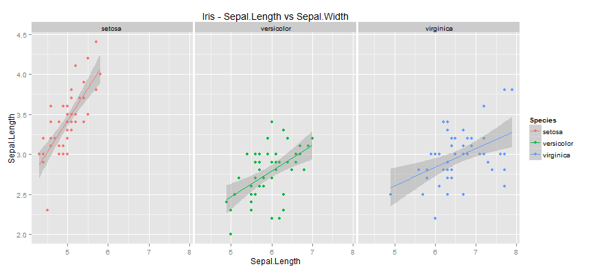
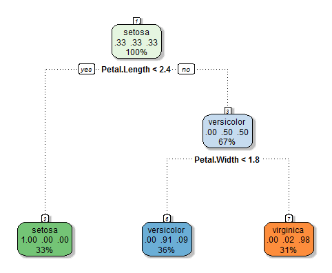
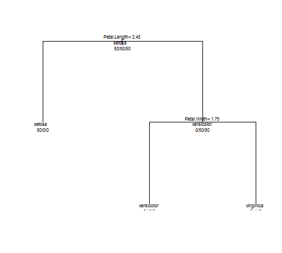

## Introduction 

 - Iris data set gives the measurements in centimeters of the variables sepal length and width and petal length and width, respectively, for 50 flowers from each of 3 species of iris.
  - The species are Iris setosa, versicolor, and virginica.
  - This R-shiny application helps to analyse the data and predict Species for new set of measurements 
  - The application is built and hosted on shinyapps.io site.

The shiny app (https://shamigupta.shinyapps.io/CaseStudy2) built will help us perform 3 tasks:

  - Analyse the correlation between the pairs of measurements using a scatter plot.
  - A model is built on this dataset using decision trees - to provide an graphical diagram of the leaves and the nodes.
  - User interface to specify a combination of the parameter on which the model predicts the name of the Species dynamically


--- .smallcode 
## Correlation between measurements

  - Analysing the correlation between measurements will help us visualize how the data gets clustered for each of the species.
  

  - Above scatter plot shows how Sepal.Length and Sepal.Width are correlated against each of the species.
    
  - Similar plots can be tried out using the shiny app, for all possible combinations to understand how pairs of variable can be used to discriminate Species.


---
## Building the Prediction Model - The Decision Tree 

  - A decision tree model is shown in two forms - the normal and the fancy plot (user choses either)

  - The model is represented diagramatically for study based upon the iris dataset





**Note**

Due to issues with RGTk2, rattle did not get loaded to the shinyapps. The fancy plot (on the left) as shown in shinyapps is a picture generated by the local run


--- .codefont .outfont .codemargin .outmargin .nobackground .slidify
## Predicting the species
  - The shiny application predicts the species from the predictor paramters - sepal length and width and petal length and width, respectively. The model works as following - 
  - Fitting the parameters to the model as predictors - Split the iris data in 60:40 ratio between train and test
  - Use the train data to tune the Decision Tree Model
  - Use the splitted test data to predict the Species
  - Confusion Matrix - Predicted Species vs Test Species - Accuracy is 95% ie Margin of error is 5%

```
## Confusion Matrix and Statistics
## 
##             Reference
## Prediction   setosa versicolor virginica
##   setosa         20          0         0
##   versicolor      0         19         2
##   virginica       0          1        18
## 
## Overall Statistics
##                                           
##                Accuracy : 0.95            
##                  95% CI : (0.8608, 0.9896)
##     No Information Rate : 0.3333          
##     P-Value [Acc > NIR] : < 2.2e-16       
##                                           
##                   Kappa : 0.925           
##  Mcnemar's Test P-Value : NA              
## 
## Statistics by Class:
## 
##                      Class: setosa Class: versicolor Class: virginica
## Sensitivity                 1.0000            0.9500           0.9000
## Specificity                 1.0000            0.9500           0.9750
## Pos Pred Value              1.0000            0.9048           0.9474
## Neg Pred Value              1.0000            0.9744           0.9512
## Prevalence                  0.3333            0.3333           0.3333
## Detection Rate              0.3333            0.3167           0.3000
## Detection Prevalence        0.3333            0.3500           0.3167
## Balanced Accuracy           1.0000            0.9500           0.9375
```
